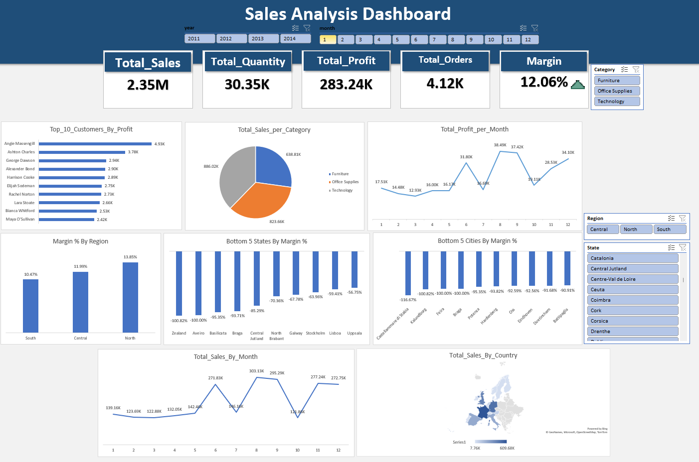

# Excel-sales-analysis-dashboard

# Project Overview

## Objective:
This project aims to create a comprehensive dashboard in Excel to analyze and visualize Key Performance Indicators (KPIs) related to orders. The dashboard will provide valuable insights into business metrics, facilitating swift decision-making concerning sales and order management systems.

## Project Steps:
1. **Data Cleaning and Preparation using Power Query:**
   - Perform data cleaning and preparation using Power Query to ensure data integrity and consistency.

2. **Data Modeling and Table Relationships:**
   - Establish data models and define table relationships within Excel to effectively structure and organize the dataset.

3. **Finding Insights and KPIs:**
   - Identify and extract key insights and performance indicators from the orders data, including sales trends and order fulfillment metrics.

4. **Visualizing using Meaningful Charts:**
   - Utilize various chart types in Excel to visually represent the identified KPIs and insights, facilitating easy comprehension for stakeholders.
  

